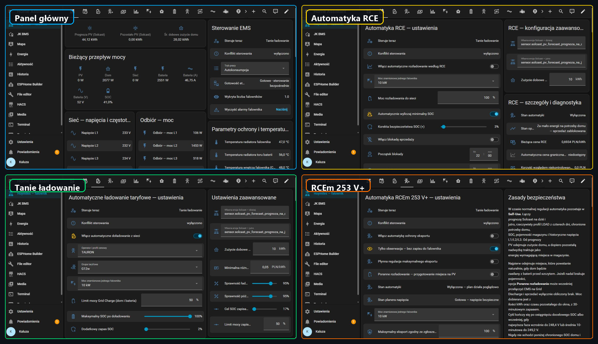

# Hoymiles HIT xxL G3 Modbus

[English](README.md) · [Polski](README.pl.md)

Local monitoring and automated energy management for Hoymiles HIT xxL G3
hybrid inverters in Home Assistant.

[](https://my.home-assistant.io/redirect/hacs_repository/?owner=Kaluzaburza&repository=Hoymiles_HIT_xxL_G3_ModBus&category=integration)
[](https://github.com/Kaluzaburza/Hoymiles_HIT_xxL_G3_ModBus/releases/latest)
[](https://github.com/Kaluzaburza/Hoymiles_HIT_xxL_G3_ModBus/actions/workflows/validate.yml)
[](LICENSE)

The project connects an ESP32 to the inverter over Modbus RTU and adds a
localized Home Assistant integration, the Aurora dashboard, and optional EMS
automations. All control logic runs locally. Forecast-based features use
Solcast, and RCE optimization uses the public PSE price API.

**New installation:** follow the [five-step quick start](docs/QUICK_START.md).
An installation and feature overview is also included below.

## Overview



The default dashboard focuses on current operation, planned actions, and
results. Expert sections expose model inputs, calculated reserves, physical
limits, data quality, and the reason why an action was executed or blocked.
The interface is available in English and Polish and adapts to desktop and
mobile screens.

### Included functions

| Area | Included capability |
|---|---|
| Local monitoring | PV1–PV4, household load, grid, battery, BMS, GEN, inverter state, alarms, temperatures, energy totals, and parallel-system totals |
| Inverter control | Self-Use, Off-Grid, Grid Charge, Grid Discharge, charge and discharge limits, SOC targets, schedules, and explicit export control |
| RCE optimization | Selects the highest-value permitted 30-minute export intervals while protecting household demand and the backup reserve |
| Tariff charging | Plans charging in cheaper tariff periods when forecast PV and stored energy will not cover later demand |
| Experimental RCEm 253 V+ | Detects recurring high-voltage periods, plans battery headroom, and can regulate charging or export without changing grid-protection settings |
| Battery service | Schedules LiFePO4 balancing cycles, prioritizes PV, completes charging from the grid when needed, and holds full SOC for a configured period |
| Diagnostics | Installation status, control conflicts, input freshness, command acknowledgment, privacy-filtered ZIP reports, and detailed optimizer data |

Only one automatic module may write EMS settings at a time. Mutual-exclusion
rules prevent RCE, tariff charging, RCEm, battery balancing, and manual
schedules from issuing conflicting commands.

## Compatibility and requirements

| Component | Requirement |
|---|---|
| Inverter | Hoymiles HIT xxL G3 family; development and field testing have focused primarily on HIT-10L-G3 and HIT-20L-G3 installations |
| ESP32 | ESP32 board supported by ESPHome; the public configuration defaults to `esp32dev` |
| RS485 interface | UART/TTL-to-RS485 converter with **3.3 V UART logic**; an automatic-direction model is recommended |
| ESPHome | 2026.7 or newer |
| Home Assistant | 2026.7 or newer |
| HACS | 2.x |

Forecast-based planning for RCE optimization, tariff charging, and RCEm requires
[BJReplay Solcast PV Forecast](https://github.com/BJReplay/ha-solcast-solar).
RCE prices require internet access to the public PSE API. Home Assistant
Recorder must retain the history of the relevant power and energy entities; this is enabled
by default in a standard installation. An additional household energy meter is
not required.

The standard Modbus settings are `115200 8N1`, unit address `1`.

## Architecture

```text
Hoymiles inverter ── RS485 / Modbus RTU ── ESP32 / ESPHome
                                                   │
                                           native ESPHome API
                                                   │
                                      Home Assistant integration
                                          │                  │
                                   Aurora dashboard      Local EMS

HACS installs and updates the Home Assistant integration.
ESPHome downloads the versioned register packages directly from GitHub.
```

The Home Assistant integration creates stable, localized proxy entities from
the native ESPHome device. It listens for Home Assistant state changes and does
not add another Modbus polling cycle.

## Safety

> [!IMPORTANT]
> **The EMS manages energy; it does not manage electrical or grid safety.**
> It does not change certified grid profiles, protection thresholds, or the
> three-phase imbalance setting. It cannot disable the inverter's protection
> functions.

> [!WARNING]
> This project can write operating parameters to a high-power inverter. Before
> enabling writable entities or automatic control, verify the exact inverter
> model, register map, RS485 wiring, battery and BMS limits, and distribution
> system operator requirements. Use the software at your own risk.

EMS writes are limited to documented operational controls. Mode changes write
the complete register block `4300–4306` with Modbus function 16 (`0x10`, Write
Multiple Registers). Writing only register `4300` can leave the inverter with
an inconsistent EMS configuration.

The project implements EMS functions that may support a documented technical
acceptance process. It is **not** a formal certificate for the inverter,
battery, or complete electrical installation, and it does not confirm
eligibility for any subsidy program. See the
[safety and functional mapping](docs/SAFETY_AND_COMPLIANCE.md).

## Installation

### 1. Install the Home Assistant integration through HACS

1. Use the **Open this repository in HACS** button at the top of this page.
2. If adding it manually, open **HACS → three-dot menu → Custom repositories**,
   enter
   `https://github.com/Kaluzaburza/Hoymiles_HIT_xxL_G3_ModBus`, and select
   **Integration**.
3. Install **Hoymiles HIT xxL G3 Modbus** and restart Home Assistant.

HACS installs the Home Assistant component. ESPHome firmware is configured in
a separate step and downloads its own versioned packages from this repository.

### 2. Connect the ESP32 and RS485 converter

Two converter types are common. Confirm the actual module specification rather
than relying on a product listing.

| Converter type | Typical UART-side pins | ESPHome configuration |
|---|---|---|
| **Automatic direction — recommended** | `VCC`, `GND`, `TXD`, `RXD` (sometimes `DI`, `RO`) | No direction-control pin |
| **Manual direction, such as a MAX3485-based module or a properly level-shifted MAX485 module** | `VCC`, `GND`, `DI`, `RO`, `DE`, `/RE` | Join `DE` and `/RE`, connect them to one ESP32 GPIO, and configure `flow_control_pin` |

#### Automatic-direction converter

```text
ESP32                        RS485 converter                  Inverter
GPIO17 (TX)  ------------->  RXD / DI
GPIO16 (RX)  <-------------  TXD / RO
3.3 V        ------------->  VCC  (only if rated for 3.3 V)
GND          --------------  GND  -------------------------- GND / reference
                              A / D+ ------------------------- A+ / D+
                              B / D- ------------------------- B- / D-
```

`TX` must reach the converter input (`RXD` or `DI`), and `RX` must receive the
converter output (`TXD` or `RO`). Labels differ between modules, so check the
signal direction in the converter documentation.

#### Converter with `DE` and `/RE`

Use the same power, data, and RS485 connections, then join the direction pins:

```text
MAX3485 DE ----+
               +------------ GPIO4 (example)
MAX3485 /RE ---+
```

Add this block outside the existing `packages:` section in
`hoymiles-inverter.yaml`. It extends the UART created by the package:

```yaml
uart:
  - id: !extend modbus_uart
    flow_control_pin:
      number: GPIO4
      inverted: false
```

Use another suitable output-capable GPIO when GPIO4 is unavailable. Do not
create a second Modbus hub.

#### Before powering on

1. Before changing wiring, isolate every energy source connected to the hybrid
   inverter—AC grid, PV, battery, EPS/backup, and GEN where present—by following
   the manufacturer's shutdown procedure. A qualified person must verify the
   absence of voltage before work begins.
2. Verify that the converter uses 3.3 V UART logic. Never connect a 5 V `RO`
   output or apply any other 5 V signal to an ESP32 GPIO.
3. Connect `A/D+` to `A+/D+`, `B/D−` to `B−/D−`, and the Modbus reference/GND
   when required by the inverter manual.
4. Never connect ESP32 `3.3 V` or converter `VCC` to an inverter communication
   terminal.
5. Use the port documented for the exact inverter model as its external
   RS485/Modbus port. Do not select a `Parallel` connector only because the plug
   looks identical.
6. If communication is still unavailable after the other checks, repeat the
   complete isolation and voltage-verification procedure before checking whether
   the converter uses reversed `A/B` labeling.

### 3. Flash the ESP32

1. Create an ESPHome device or copy the public entry configuration
   [`hoymiles-inverter.yaml`](hoymiles-inverter.yaml) into the ESPHome
   configuration directory.
2. Copy the keys from [`secrets.yaml.example`](secrets.yaml.example) to the
   local `secrets.yaml` and replace every example value.
3. Confirm the board, `uart_tx_pin`, and `uart_rx_pin` substitutions.
4. Add the `!extend modbus_uart` block only when the converter needs manual
   `DE`/`/RE` control.
5. Validate, compile, and install the firmware.

Do not copy the repository's `packages` directory. The public entry file
downloads the compatible, versioned ESPHome packages directly from GitHub.

If compilation succeeds but all Modbus entities remain unavailable, check the
converter type and direction pins, common reference/GND, `A/B` polarity,
inverter port, and Modbus address—in that order.

### 4. Add both integrations

1. Add the discovered ESP32 through Home Assistant's standard **ESPHome**
   integration.
2. Open **Settings → Devices & services → Add integration**.
3. Select **Hoymiles HIT xxL G3 Modbus** and choose the ESPHome device.

The integration automatically installs and registers:

- `/config/dashboard_hoymiles.yaml` for legacy or manual dashboard use;
- `/config/packages/hoymiles_ems_scheduler.yaml`;
- the versioned Aurora frontend module.

If Home Assistant packages are not enabled, **Settings → System → Repairs**
shows the required action. When `configuration.yaml` does not yet contain a
`homeassistant:` section, add:

```yaml
homeassistant:
  packages: !include_dir_named packages
```

When that section already exists, add only the indented `packages:` line below
its existing entries—do not add a second `homeassistant:` key. Validate the
configuration and restart Home Assistant.

### 5. Add the Aurora dashboard and verify the installation

1. Open **Settings → Dashboards → Add dashboard**.
2. Select the community dashboard **Hoymiles HIT xxL G3**.
3. Open the integration and confirm **Installation status = Ready**.
4. Review **Settings → System → Repairs** before enabling automatic writes.

The dashboard strategy loads the English or Polish dashboard bundled with the
installed integration. It therefore updates after a HACS update and Home
Assistant restart without requiring users to paste YAML again.

## Updating

1. Read the **User update steps** in the HACS release notes.
2. Install the update through HACS.
3. Restart Home Assistant once.
4. Check **Installation status** and **Repairs**. An update from an older
   release can require one additional restart after the managed EMS package has
   been copied.
5. Rebuild ESP32 firmware only when the release notes explicitly require it.

The integration preserves user-modified copies of managed files. Built-in
migrations for storage-mode dashboards update only the required managed card types, entity
rows, or asset paths and create a `.pre-<version>.bak` backup before writing.

To replace local asset copies deliberately, first back up every customized
dashboard and EMS package file, then call:

```yaml
action: hoymiles_hit_modbus.install_assets
data:
  overwrite: true
```

Do not add a manual `/local/hoymiles-rce-chart-card.js` Lovelace resource. The
integration registers its versioned frontend module automatically.

## EMS automation

### Operating rules shared by every mode

- Automatic control is optional and disabled until configured by the user.
- RCE, tariff charging, and RCEm are mutually exclusive.
- A LiFePO4 balancing cycle temporarily has higher priority than other plans.
- Missing or stale critical data block automatic writes and, when necessary,
  trigger a controlled return to Self-Use.
- Battery and inverter limits, parallel-system readiness, export lockouts, and
  the Generation Control Function (GCF) limit are checked before execution.
- Commands are rate-limited, latched where necessary, and confirmed by reading
  the resulting inverter state where that feedback is available. Broadcast
  writes are checked through subsequent state reads rather than a Modbus reply.
- The integration does not automate the three-phase imbalance setting.

### RCE market-price optimization

The RCE planner evaluates all available 30-minute PSE price intervals for today
and tomorrow. It calculates household and backup reserves, forecast PV,
expected natural export, battery capacity, conversion losses, BMS and inverter
power limits, parallel-system power, and configured export lockout periods. It
then assigns available energy to the highest-value permitted intervals.

The reserve is rounded conservatively to a full inverter SOC step and is
enforced in every planned export interval. When a fresh third-day forecast is
available, a projected household-energy shortfall adds a terminal reserve. The
model values that stored energy against the avoided grid purchase, which helps
prevent selling it cheaply and buying it back later at a higher price.

The dashboard separates projected and measured results, controlled battery
export, natural PV surplus, and unclassified historical export. It reports
additional gross revenue and estimated net optimization benefit after
accounting for battery wear and the terminal value of stored energy. These figures are estimates, not a supplier
invoice or a guarantee of savings.

### Tariff-aware grid charging

The tariff planner simulates household demand, PV generation, and battery SOC
in 30-minute steps. Fresh third-day Solcast data extends the simulated horizon
to at least 48 hours. If those data are missing or stale, the known shorter
horizon is reported and the remaining period is protected by a conservative
reserve based on zero PV and average household demand.

The calculation includes the backup reserve, BMS limits, conversion losses,
and the shared Grid Charge power limit, which supplies the house before the
remaining power reaches the battery. The planner can learn the effective
battery charging rate from confirmed sessions and starts early enough to store
the required energy before a more expensive tariff period.

Bundled profiles cover G11, G12, G12w, and G13 where offered by PGE, TAURON,
ENEA, ENERGA, and STOEN. They include seasons, weekends, and Polish public
holidays. Built-in 2026 variable per-kWh rates include the modeled variable
components, but not fixed charges. Treat them as a starting point and verify
them against the current supplier contract and bill. Use the **Manual** profile
for another product or supplier.

### Experimental RCEm 253 V+ voltage management

RCEm analyzes phase-voltage history from the previous four days together with
live L1/L2/L3 voltage, the rolling 10-minute voltage average, interval Solcast
profiles, weekday or weekend household demand, and available battery capacity.
It creates an independent headroom plan for every detected risk period.

The controller can increase battery charging as voltage rises. Optional morning
discharge can create only the battery headroom needed without crossing the
protected household reserve. Optional export regulation never exceeds the lower
of the current inverter setting and the user-defined cap.

RCEm starts in **observation-only mode** and performs no writes until the user
explicitly disables that mode. It does not disable certified protection,
change protection thresholds, enable GCF, or alter three-phase imbalance. The
feature has extensive simulation coverage but remains experimental and requires
validation and commissioning on the actual installation. It is not intended to
bypass applicable grid-code or distribution-system-operator voltage limits.

### LiFePO4 battery balancing

The optional service cycle runs at an interval selected by the user. After
sunrise, normal Self-Use operation lets PV charge the battery first. After
sunset, the cycle can supply the missing energy from the grid. Between 99% and
100% SOC it targets approximately 2 kW of battery charging, adjusted for the
household demand that shares the Grid Charge limit. The hold timer begins only
after full SOC is confirmed. Previous charge settings and EMS mode are restored
when the cycle ends or is canceled.

## Parallel inverter systems

The standard ESPHome configuration reads topology registers `6048–6095` and
distinguishes a single inverter, Master, and Slave automatically. No manual
inverter-count setting is required.

Connect the ESP32 Modbus converter to the **Master** using the external RS485
bus documented for the installation. When a Master is detected, EMS writes use
one Modbus function 16 (`0x10`) broadcast to address `0`, allowing the complete
register block `4300–4306` to reach the Master and Slaves on the shared
`RS485_2` bus. Broadcast writes do not expect a response. Commands are blocked
if the connected unit reports the Slave role or if the Master reports an
invalid device count.

The Aurora dashboard automatically uses the manufacturer's system-wide power
registers for PV, battery, household load, and grid power. The addresses listed
in topology registers are internal parallel-network diagnostics; the ESP32 does
not poll them as separate Modbus unit IDs through the Master's external port.

The entity that writes register `3016` (**Parallel Networking Command**) remains
disabled by default. This commissioning command creates or disassembles the
parallel network and is never used by the EMS automation.

Refer to the inverter manual for maximum unit counts, contactor requirements,
meter and DTS placement, and termination of the first and last device on the
dedicated parallel communication bus.

## Firmware compatibility

The integration creates stable proxy entities for the complete catalog. If the
installed ESPHome firmware predates a new register, its proxy remains present
but unavailable and reports `firmware_update_required: true`. Recompiling and
flashing the ESP32 firmware with the current packages activates the same entity
without changing its entity ID or unique ID.

The integration release and ESPHome package release are versioned separately.
Always follow the compatibility information in the release notes rather than
assuming both version numbers must match.

## Diagnostics and support

Before reporting a problem, record:

- exact inverter model and firmware version;
- ESPHome and Home Assistant versions;
- local date and time of the event;
- expected and observed behavior;
- relevant logs with credentials and personal data removed.

Download the privacy-filtered diagnostics ZIP from the final **Diagnostics**
dashboard view or use Home Assistant's native **Download diagnostics** action.
For ESPHome, Modbus, startup, or automation-loop problems, the extended terminal
collector is also available. The exact contents and anonymization rules are
documented in [Diagnostics](docs/DIAGNOSTICS.md).

Review every archive before attaching it to a public issue. Automated filtering
does not replace a manual check for credentials and personal data.

Open a [GitHub issue](https://github.com/Kaluzaburza/Hoymiles_HIT_xxL_G3_ModBus/issues)
or send the report with a problem description to
[info@kaluzaaa.com](mailto:info@kaluzaaa.com).

If the ESPHome log window repeatedly reports `SocketClosedAPIError` while
entities continue to update, close duplicate log streams, wait approximately
15 seconds, and restart only the ESPHome Device Builder add-on. See the
[diagnostics guide](docs/DIAGNOSTICS.md) before reflashing the ESP32.

## Documentation

| Document | Purpose |
|---|---|
| [Quick start](docs/QUICK_START.md) | Short installation path for new users |
| [Diagnostics](docs/DIAGNOSTICS.md) | Report collection, anonymization, and troubleshooting |
| [Safety and functional mapping](docs/SAFETY_AND_COMPLIANCE.md) | Implemented safeguards, boundaries, and audit evidence |
| [Automation test report](docs/AUTOMATION_TEST_REPORT.md) | Simulation scope, static control checks, and field-test limits |
| [Changelog](CHANGELOG.md) | Release history and required update steps |
| [Release procedure](RELEASING.md) | Maintainer checklist for GitHub and HACS releases |

## Development

```text
custom_components/hoymiles_hit_modbus/  Home Assistant integration
packages/                               ESPHome Modbus register packages
examples/esphome/                       ESPHome example configuration
home_assistant/                         Source dashboard card and EMS package
docs/                                   User, safety, and test documentation
tools/                                  Asset generators and release tests
```

Regenerate localized catalogs and bundled assets with:

```bash
python tools/build_hacs_assets.py
```

GitHub Actions run HACS validation, Hassfest, frontend checks, and project
tests. Contributions must follow [CONTRIBUTING.md](CONTRIBUTING.md) and include
the required `Signed-off-by` line.

## Support the project

The integration and EMS functions are free and open-source software. If the
project is useful, you can support continued development, documentation, and
testing:

[☕ Support development](https://buycoffee.to/kaluzaaa)

## License

This project is available under the [MIT License](LICENSE). Private and
commercial use, modification, and distribution are permitted when the
copyright and permission notices are retained. The software is provided
without warranty.
