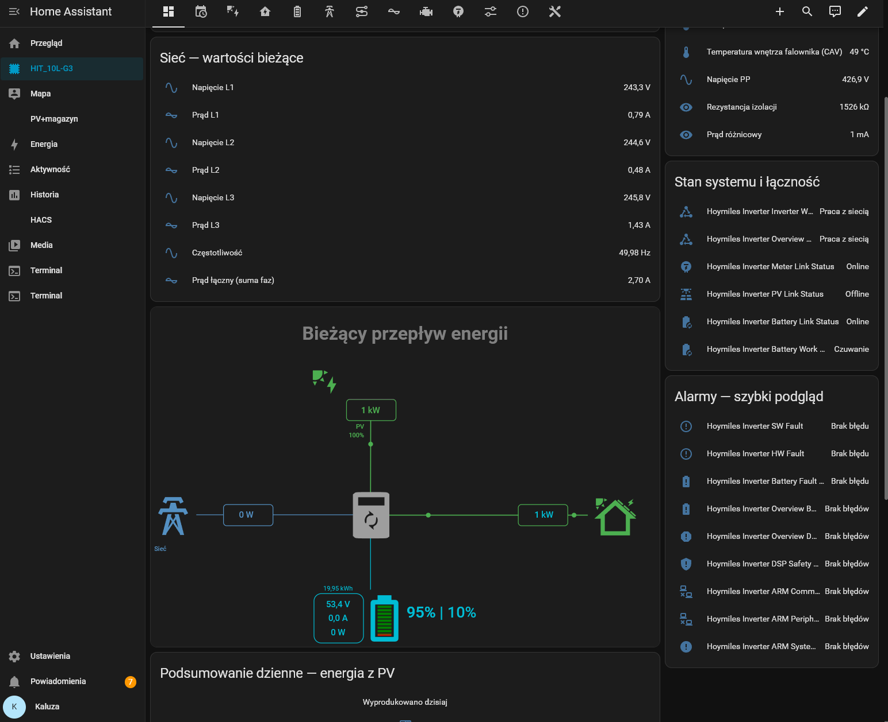
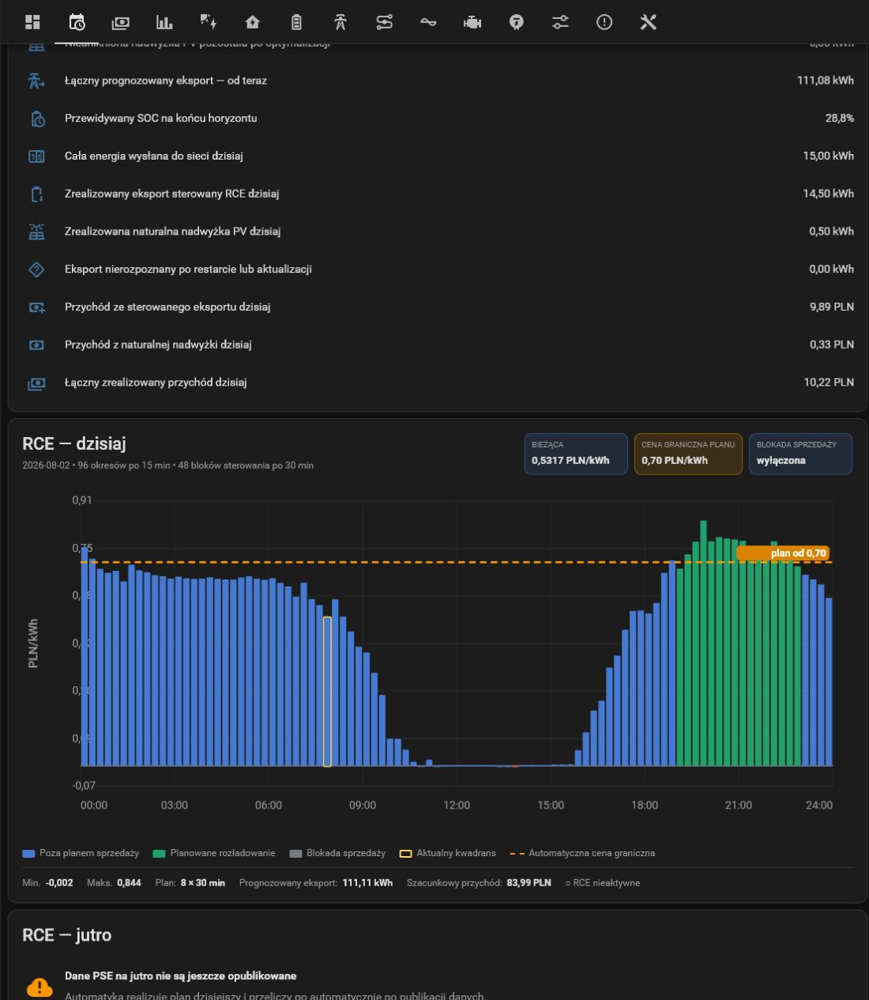

# Hoymiles HIT xxL G3 Modbus

Home Assistant and ESPHome integration for Hoymiles HIT xxL G3 hybrid
inverters using Modbus RTU over an ESP32 RS485 bridge.

[](https://my.home-assistant.io/redirect/hacs_repository/?owner=Kaluzaburza&repository=Hoymiles_HIT_xxL_G3_ModBus&category=integration)

Version **1.1.0** is the current public release. It contains:

- 273 localized read-only and writable Modbus entities;
- four physical PV inputs (PV1–PV4);
- grid, load/EPS, battery/BMS, generator and inverter registers;
- safe atomic EMS writes for registers 4300–4306;
- daily grid charge/discharge schedules;
- PSE RCE price-based discharge automation with an export lockout window;
- optional Solcast- and LOAD-based dynamic SOC reserve with protected
  night-time home demand;
- a ready-to-import Home Assistant dashboard and RCE chart card;
- English and Polish entity names, select options, config flow and services.

> [!WARNING]
> This project writes operating parameters to a high-power inverter. Verify the
> register map, wiring, battery limits and grid-code requirements for your exact
> model before enabling writable entities. You use it at your own risk.

## Architecture

```text
Hoymiles inverter ── RS485/Modbus RTU ── ESP32/ESPHome
                                              │
                                      native ESPHome API
                                              │
                                    Home Assistant + HACS
```

The HACS integration creates localized, stable proxy entities from the native
ESPHome device. It listens to Home Assistant state events, so it does **not**
add another Modbus polling cycle.

## Screenshots / Zrzuty ekranu

### Live energy flow / Bieżący przepływ energii



### RCE automation / Automatyka cenowa RCE



## Requirements

- a compatible Hoymiles HIT xxL G3 inverter (tested primarily with HIT-10L-G3);
- ESP32 with a 3.3 V RS485 transceiver such as MAX3485 or Waveshare RS485;
- ESPHome 2026.7 or newer;
- Home Assistant 2026.7 or newer;
- HACS 2.x.

## ESP32 and RS485 wiring

The default configuration assumes a **3.3 V TTL ↔ RS485 converter with
automatic direction control**.

```text
ESP32                         RS485 converter                    Inverter
GPIO17 (TX)  ---------------> DI
GPIO16 (RX)  <--------------- RO
3.3 V        ---------------> VCC (3.3 V)
GND          ---------------- GND ------------------------------ GND (Modbus)
                                A+ ------------------------------ A+ (Modbus)
                                B- ------------------------------ B- (Modbus)
```

| ESP32 | Converter — TTL side | Converter — RS485 side | Inverter |
|---|---|---|---|
| GPIO17 (TX) | DI | — | — |
| GPIO16 (RX) | RO | — | — |
| 3.3 V | VCC (3.3 V) | — | — |
| GND | GND | GND/reference | GND (Modbus) |
| — | — | A+ | A+ (Modbus) |
| — | — | B− | B− (Modbus) |

> [!CAUTION]
> Disconnect all power before wiring. Never connect the inverter's RS485 lines
> directly to the ESP32 and never feed 5 V logic into an ESP32 GPIO. Confirm
> the `A/B` or `D+/D−` naming in the converter manual, because some vendors use
> reversed labels.

If the converter exposes `DE` and `/RE` and does not switch direction
automatically, tie these pins together and connect them to a free ESP32 GPIO.
Then add this override to the top-level ESPHome file, using the selected pin:

```yaml
modbus:
  - id: modbus_1
    flow_control_pin: GPIO4
```

## 1. Install through HACS

Install the Home Assistant integration before configuring the ESP32 so it is
ready after the device is discovered.

1. Open **HACS → Integrations → Custom repositories**.
2. Add:
   `https://github.com/Kaluzaburza/Hoymiles_HIT_xxL_G3_ModBus`
3. Select the **Integration** category.
4. Download **Hoymiles HIT xxL G3 Modbus** and restart Home Assistant.

The integration automatically uses the Home Assistant language. English and
Polish translations are bundled in `translations/en.json` and
`translations/pl.json`.

## 2. Flash the ESP32

Copy the self-contained [`hoymiles-inverter.yaml`](hoymiles-inverter.yaml) to
your ESPHome configuration directory. Copy the required keys from
[`secrets.yaml.example`](secrets.yaml.example) to your local `secrets.yaml`,
then adjust the UART pins and board.

Do **not** copy the repository's `packages` directory. The public ESPHome entry
file downloads all versioned register packages directly from GitHub. It does
not depend on files installed by HACS.

Compile and flash the configuration from ESPHome. Default serial settings are
Modbus RTU `115200 8N1`, slave address `1`.

## 3. Add the integrations

1. Add the discovered device through the standard **ESPHome** integration.
2. Open **Settings → Devices & services → Add integration**.
3. Search for **Hoymiles HIT xxL G3 Modbus** and select that ESPHome device.

## 4. Dashboard and EMS automation

During setup, the integration can copy:

- `/config/dashboard_hoymiles.yaml`;
- `/config/packages/hoymiles_ems_scheduler.yaml`;
- `/config/www/hoymiles-rce-chart-card.js`.

If Home Assistant packages are not enabled yet, add this under the existing
`homeassistant:` section in `configuration.yaml`:

```yaml
homeassistant:
  packages: !include_dir_named packages
```

Do not create a second `homeassistant:` key. Check the configuration and restart
Home Assistant.

Add the dashboard resource:

```text
/local/hoymiles-rce-chart-card.js?v=1.1.0
```

with resource type **JavaScript module**, then import
`/config/dashboard_hoymiles.yaml` in the raw dashboard editor.

Updating the integration in HACS does not rewrite a dashboard previously pasted
into Home Assistant's storage-mode raw editor. After an update that changes
entity references, reinstall the bundled assets and import the dashboard file
again. The installer migrates legacy device-name-dependent IDs in the file and
keeps a `.pre-stable-entity-ids.bak` backup before changing it.

To reinstall the bundled assets later, call:

```yaml
action: hoymiles_hit_modbus.install_assets
data:
  overwrite: true
```

## EMS safety

Changing the EMS mode writes the complete register block `4300–4306` with one
FC10 command. Writing register `4300` alone may leave the inverter with an
inconsistent EMS configuration.

The provided EMS automation supports:

- Self-Use;
- Off-Grid;
- grid charge;
- grid discharge;
- daily start time and duration;
- charge/discharge power and SOC limits;
- PSE RCE prices in 30-minute control blocks;
- an optional dynamic RCE minimum SOC calculated from the BJReplay Solcast
  `Forecast Tomorrow` sensor, the trailing four-day LOAD average, inverter
  battery capacity, the Self-Use outage reserve, the remaining home demand
  between 90 minutes before sunset and 90 minutes after sunrise, and a user
  safety correction;
- a configurable export lockout window, including ranges across midnight.

Manual schedules take priority over RCE automation. The export lockout always
returns the inverter to Self-Use and blocks manual, scheduled and RCE export.
Dynamic SOC control fails safe: missing Solcast, LOAD history, sun data or
battery capacity data blocks automatic RCE export. Install and configure
[BJReplay Solcast PV Forecast](https://github.com/BJReplay/ha-solcast-solar)
before enabling this option. The package automatically detects both the
English `sensor.solcast_pv_forecast_forecast_tomorrow` and Polish
`sensor.solcast_pv_forecast_prognoza_na_jutro` entity IDs.

During the protected night window, the reserve decreases with the remaining
time until 90 minutes after sunrise. After the first complete day, the estimate
uses the measured average consumption from up to four previous protected
windows; before that, it falls back to a proportional share of the four-day
daily LOAD average.

## Repository structure

```text
custom_components/hoymiles_hit_modbus/  HACS integration
packages/                               ESPHome Modbus register packages
examples/esphome/                       public ESPHome entry configuration
home_assistant/                         dashboard card and source EMS package
docs/images/                            README screenshots
tools/                                  catalog and validation scripts
```

## Development

Regenerate the localized entity catalog and bundled assets:

```bash
python tools/build_hacs_assets.py
```

GitHub Actions run HACS validation, Hassfest and local structural tests.

## Support

Please open an issue and include:

- exact inverter model and firmware version;
- ESPHome and Home Assistant versions;
- relevant logs with secrets removed;
- the affected Modbus register and the expected value.

---

## Polski

Integracja łączy falowniki hybrydowe Hoymiles HIT xxL G3 z Home Assistantem
przez ESP32 i magistralę RS485/Modbus RTU. Wersja **1.1.0** udostępnia
273 encje, cztery wejścia PV, ustawienia baterii i EMS, harmonogramy dobowe,
automatykę cenową RCE PSE, dynamiczną rezerwę SOC na podstawie Solcast i LOAD,
ochronę nocnego zapotrzebowania domu, blokadę sprzedaży oraz gotowy dashboard.

### Podłączenie ESP32 i konwertera RS485

Domyślna konfiguracja jest przygotowana dla konwertera
**3,3 V TTL ↔ RS485 z automatycznym przełączaniem kierunku transmisji**.

```text
ESP32                         Konwerter RS485                    Falownik
GPIO17 (TX)  ---------------> DI
GPIO16 (RX)  <--------------- RO
3,3 V        ---------------> VCC (3,3 V)
GND          ---------------- GND ------------------------------ GND (Modbus)
                                A+ ------------------------------ A+ (Modbus)
                                B- ------------------------------ B- (Modbus)
```

| ESP32 | Konwerter — strona TTL | Konwerter — strona RS485 | Falownik |
|---|---|---|---|
| GPIO17 (TX) | DI | — | — |
| GPIO16 (RX) | RO | — | — |
| 3,3 V | VCC (3,3 V) | — | — |
| GND | GND | GND/referencja | GND (Modbus) |
| — | — | A+ | A+ (Modbus) |
| — | — | B− | B− (Modbus) |

> [!CAUTION]
> Podłączenia wykonuj przy wyłączonym zasilaniu. Nie podłączaj przewodów RS485
> falownika bezpośrednio do GPIO ESP32 i nie podawaj napięcia logicznego 5 V na
> ESP32. Sprawdź w instrukcji konwertera oznaczenia `A/B` lub `D+/D−`, ponieważ
> niektórzy producenci stosują odwrotne nazewnictwo.

Jeżeli konwerter ma osobne wejścia `DE` i `/RE` i nie przełącza kierunku
automatycznie, połącz je razem, podłącz do wolnego GPIO ESP32 i dodaj do
głównego pliku ESPHome:

```yaml
modbus:
  - id: modbus_1
    flow_control_pin: GPIO4
```

### Instalacja

1. W HACS dodaj to repozytorium jako niestandardowe repozytorium typu
   **Integration**, zainstaluj je i uruchom Home Assistant ponownie.
2. Skopiuj samowystarczalny
   [`hoymiles-inverter.yaml`](hoymiles-inverter.yaml) do ESPHome, uzupełnij
   sekrety oraz piny UART i wgraj firmware. Plik automatycznie pobierze
   wersjonowane pakiety rejestrów z GitHuba — nie kopiuj katalogu `packages`.
3. Dodaj urządzenie przez standardową integrację ESPHome.
4. Dodaj integrację **Hoymiles HIT xxL G3 Modbus** i wybierz urządzenie ESPHome.
5. Włącz pakiety Home Assistanta, dodaj zasób karty JavaScript i zaimportuj
   skopiowany dashboard zgodnie z instrukcją powyżej.

Aktualizacja integracji w HACS nie nadpisuje dashboardu wklejonego wcześniej do
surowego edytora działającego w trybie pamięci masowej. Po wydaniu zmieniającym
identyfikatory encji trzeba ponownie zainstalować zasoby i jeszcze raz
zaimportować `/config/dashboard_hoymiles.yaml`. Instalator zamienia stare
identyfikatory zależne od nazwy urządzenia i przed zmianą tworzy kopię
`.pre-stable-entity-ids.bak`.

Nazwy encji i opcje wyboru są tłumaczone automatycznie na polski lub angielski
zależnie od języka Home Assistanta. Pierwsze tłumaczenia są celowo opisowe i
mogą być dalej poprawiane w plikach `translations/pl.json` oraz
`translations/en.json`.

### Bezpieczeństwo

Integracja zapisuje ustawienia falownika. Przed użyciem sprawdź model, mapę
rejestrów, limity BMS oraz wymagania operatora sieci. Tryb EMS jest zapisywany
atomowo jako cały blok `4300–4306`, tak jak po użyciu przycisku **Save** w
aplikacji producenta.
